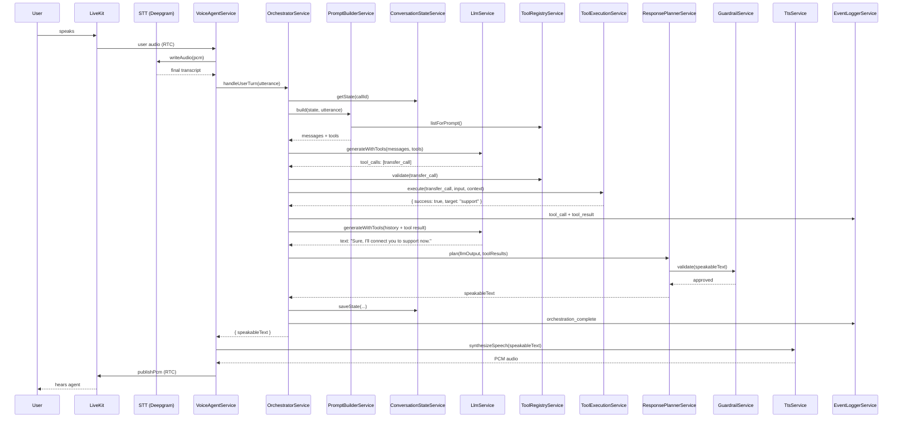

# LiveKit Agent Orchestration Plan

This document describes how to add a **Retell-style orchestration layer** on top of the existing LiveKit voice agent POC. It is aligned with the current NestJS modules and proposes concrete services, file locations, and a phased rollout.

**Related doc:** [LIVEKIT_VOICE_AGENT_FLOW.md](./LIVEKIT_VOICE_AGENT_FLOW.md) — how the system works today.

---

## Current state (baseline)

Today, conversation logic lives inside a single method:

| Today | File |
|-------|------|
| Turn complete → LLM → TTS → speak | `src/voice-agent/voice-agent.service.ts` → `processUserUtterance()` |
| Session + `conversationHistory` | `src/common/types/voice-agent.types.ts` |
| LLM request/response types | `src/common/types/llm.types.ts` |
| Per-step logging | `src/call-logs/call-logs.service.ts` |
| Latency milestones | `src/performance/performance.service.ts` |

The orchestration layer will **replace the inline LLM call** in `processUserUtterance()` with a dedicated pipeline, while keeping STT, RTC, and TTS unchanged.

```
Today:
  onUserTurnComplete() → processUserUtterance() → LlmService → TtsService → LivekitRtcService

Target:
  onUserTurnComplete() → OrchestratorService → (tools + LLM loop) → ResponsePlanner → TtsService → LivekitRtcService
```

---

## 1. What orchestration means

**Orchestration** is the brain that decides *what the agent does next* after the user speaks. It is separate from:

- **Transport** (LiveKit RTC — `livekit-rtc.service.ts`)
- **Perception** (STT — `stt/`)
- **Speech output** (TTS — `tts/`)

Orchestration is responsible for:

| Responsibility | Example |
|----------------|---------|
| **Decide what to say next** | Answer a question vs. run a tool vs. end the call |
| **Maintain conversation state** | History, user details, current step, transfer status |
| **Build the LLM prompt** | System prompt + company rules + dynamic variables + tool definitions |
| **Handle tools/actions** | `transfer_call`, `lookup_customer`, `create_ticket` |
| **Control flow** | Transfer, pause, retry, end call, fallback on errors |
| **Log every decision** | Prompt snapshot, tool calls, planner output, guardrail blocks |

The existing `VoiceAgentService` should remain a **thin coordinator**: audio I/O, turn detection, and calling `OrchestratorService.handleUserTurn()`.

---

## 2. Proposed orchestration architecture

Add a new NestJS module: **`src/orchestration/`**

```
src/orchestration/
├── orchestration.module.ts
├── orchestrator.service.ts           # Main entry: one user turn → speakable response
├── prompt-builder.service.ts
├── conversation-state.service.ts
├── tool-registry.service.ts
├── tool-execution.service.ts
├── response-planner.service.ts
├── guardrail.service.ts
├── event-logger.service.ts
├── interfaces/
│   ├── agent-tool.interface.ts
│   ├── orchestration.types.ts
│   └── tool-execution-context.interface.ts
└── tools/
    ├── transfer-call.tool.ts
    ├── send-sms.tool.ts
    ├── check-working-hours.tool.ts
    ├── lookup-customer.tool.ts
    ├── create-ticket.tool.ts
    └── end-call.tool.ts
```

### Component responsibilities

| Service | Purpose | Integrates with |
|---------|---------|-----------------|
| **OrchestratorService** | Runs the turn loop: prompt → LLM → tools → final response | `VoiceAgentService`, `LlmService`, all orchestration services |
| **PromptBuilderService** | Assembles system + agent + history + tools + metadata into LLM messages | `ConversationStateService`, `ToolRegistryService` |
| **ConversationStateService** | Loads/saves session state per `callId` / `roomName` | Extends `VoiceAgentSession` or separate store |
| **ToolRegistryService** | Registers tools, exposes schemas to LLM, validates tool names | `tools/*.tool.ts` |
| **ToolExecutionService** | Executes tool with timeout, error wrapping, logging | `ToolRegistryService`, `EventLoggerService` |
| **ResponsePlannerService** | Converts LLM/tool output into a **single speakable string** (or multi-step plan) | `GuardrailService` |
| **GuardrailService** | Blocks unsafe text, PII leaks, over-long responses, disallowed phrases | Called before TTS |
| **EventLoggerService** | Structured orchestration events → `CallLogsService` + `PerformanceService` | `call-logs/`, `performance/` |

### Wiring into existing modules

```typescript
// voice-agent.module.ts — add import
imports: [
  OrchestrationModule,
  // ...existing
]

// voice-agent.service.ts — replace processUserUtterance() LLM block
const result = await this.orchestratorService.handleUserTurn({
  callId: session.callId,
  roomName,
  userUtterance: utterance,
});
await this.speakToRoom(roomName, result.speakableText);
```

---

## 3. Updated flow

Step-by-step after a user turn is detected (`TurnDetectionService` → `onUserTurnComplete()`):

### Step 1 — User final transcript received

- **Trigger:** `TurnDetectionService` fires `user_turn_complete` with transcript.
- **Owner:** `VoiceAgentService.onUserTurnComplete()` (unchanged entry point).

### Step 2 — Orchestrator gets current session state

- **OrchestratorService.handleUserTurn()** loads state from `ConversationStateService`.
- State includes history, dynamic variables, tool history, call status, retry count.

### Step 3 — PromptBuilder builds context

- **PromptBuilderService.build()** returns:
  - System messages (agent persona, company rules, guardrails summary)
  - Conversation history (from state)
  - Latest user utterance
  - Tool definitions (JSON schema from `ToolRegistryService`)
  - Call metadata (`roomName`, `callId`, `participantId`, SIP info when added)

### Step 4 — LLM decides: reply or tool call

- **OrchestratorService** calls `LlmService` with structured output (tool-capable request).
- Extend `LlmRequest` / `LlmResponse` in `src/common/types/llm.types.ts`:

```typescript
// Proposed extension
export interface LlmResponse {
  text: string;
  toolCalls?: Array<{ name: string; arguments: Record<string, unknown> }>;
  finishReason?: 'stop' | 'tool_calls';
}
```

### Step 5 — ToolRegistry validates requested tool

- If LLM returns `tool_calls`, **ToolRegistryService.get(name)** validates the tool exists and is enabled for this agent.

### Step 6 — ToolExecutionService executes tool

- Runs `tool.execute(input, context)` with timeout (e.g. 5s).
- Logs via **EventLoggerService** → `call-logs` step `tool_execution`.

### Step 7 — Orchestrator feeds tool result back to LLM (if needed)

- Append assistant tool-call message + tool result message to history.
- Re-invoke LLM (max **N** rounds, e.g. 3) until `finishReason === 'stop'`.

### Step 8 — ResponsePlanner decides final speakable response

- **ResponsePlannerService** picks what TTS should speak:
  - Normal assistant text
  - Tool-specific spoken message (e.g. transfer script)
  - Fallback apology on error
- Passes through **GuardrailService**.

### Step 9 — TTS converts response to audio

- **Unchanged:** `TtsService.synthesizeSpeech()` via `VoiceAgentService.speakToRoom()`.

### Step 10 — LiveKit publishes audio

- **Unchanged:** `LivekitRtcService.publishPcm()`.

### Step 11 — Logs store full trace

| Log step (extend `call-log.types.ts`) | Content |
|---------------------------------------|---------|
| `orchestration_start` | utterance, state snapshot (redacted) |
| `prompt_built` | message count, tool count (not full secrets) |
| `llm_request` / `llm_response` | existing + `toolCalls` |
| `tool_call` | name, arguments |
| `tool_result` | output or error |
| `response_planned` | final speakable text |
| `guardrail_check` | pass/block reason |
| `orchestration_complete` | total orchestration latency |

---

## 4. Tool calling design

Each tool implements `AgentTool` (see §5). Tools live in `src/orchestration/tools/` and are registered in `ToolRegistryService` at module init.

### `transfer_call`

| Field | Value |
|-------|-------|
| **name** | `transfer_call` |
| **description** | Transfer the caller to a human agent or department. |
| **input schema** | `{ department: string, reason?: string }` |
| **When to call** | User asks for human, billing, support, or escalation. |
| **expected output** | `{ success: boolean, transferId?: string, target: string }` |
| **error behavior** | Return `{ success: false, error: 'transfer_failed' }`; planner speaks fallback: *"I couldn't connect you right now. Can I take a message?"* |

*Implementation note:* Wire to LiveKit SIP REFER / outbound trunk later; POC can log + set `transferStatus` on state.

---

### `send_sms`

| Field | Value |
|-------|-------|
| **name** | `send_sms` |
| **description** | Send an SMS to the caller with a link or confirmation. |
| **input schema** | `{ phoneNumber: string, message: string }` |
| **When to call** | User requests info by text, appointment link, or follow-up. |
| **expected output** | `{ success: boolean, messageId?: string }` |
| **error behavior** | Log error; agent apologizes and offers to repeat info verbally. |

---

### `check_working_hours`

| Field | Value |
|-------|-------|
| **name** | `check_working_hours` |
| **description** | Check if support is open now and return hours. |
| **input schema** | `{ timezone?: string }` |
| **When to call** | User asks "are you open?", "what are your hours?" |
| **expected output** | `{ isOpen: boolean, hours: string, nextOpenTime?: string }` |
| **error behavior** | Return cached default hours from config; never block conversation. |

---

### `lookup_customer`

| Field | Value |
|-------|-------|
| **name** | `lookup_customer` |
| **description** | Look up customer by phone, email, or account ID. |
| **input schema** | `{ phone?: string, email?: string, accountId?: string }` |
| **When to call** | User identifies themselves or asks about account/order. |
| **expected output** | `{ found: boolean, customer?: { name, plan, status } }` |
| **error behavior** | `{ found: false }`; agent asks clarifying question. Never return full PII in spoken response — planner summarizes. |

---

### `create_ticket`

| Field | Value |
|-------|-------|
| **name** | `create_ticket` |
| **description** | Create a support ticket with summary and priority. |
| **input schema** | `{ summary: string, priority: 'low' \| 'medium' \| 'high', category?: string }` |
| **when to call** | Issue can't be resolved on call; user wants callback. |
| **expected output** | `{ ticketId: string, eta?: string }` |
| **error behavior** | Retry once; then offer manual follow-up and log failure. |

---

### `end_call`

| Field | Value |
|-------|-------|
| **name** | `end_call` |
| **description** | Politely end the call after goodbye. |
| **input schema** | `{ reason?: string }` |
| **When to call** | User says goodbye, task complete, or unrecoverable error. |
| **expected output** | `{ ended: true }` |
| **error behavior** | Still speak goodbye; `VoiceAgentService.stopSession()` in finally block. |

---

## 5. Example tool interface (TypeScript)

```typescript
// src/orchestration/interfaces/tool-execution-context.interface.ts
export interface ToolExecutionContext {
  callId: string;
  roomName: string;
  participantId?: string;
  agentId?: string;
  dynamicVariables: Record<string, string>;
  metadata: Record<string, unknown>;
}

// src/orchestration/interfaces/agent-tool.interface.ts
export interface AgentTool<TInput = Record<string, unknown>, TOutput = unknown> {
  name: string;
  description: string;
  schema: Record<string, unknown>; // JSON Schema for LLM function calling
  execute(input: TInput, context: ToolExecutionContext): Promise<TOutput>;
}

// Example registration in tool-registry.service.ts
@Injectable()
export class ToolRegistryService {
  private readonly tools = new Map<string, AgentTool>();

  register(tool: AgentTool): void {
    this.tools.set(tool.name, tool);
  }

  get(name: string): AgentTool | undefined {
    return this.tools.get(name);
  }

  listForPrompt(): Array<{ name: string; description: string; schema: Record<string, unknown> }> {
    return [...this.tools.values()].map(({ name, description, schema }) => ({
      name,
      description,
      schema,
    }));
  }
}
```

---

## 6. Prompt design

**PromptBuilderService** assembles layers in this order:

### 1. System prompt (fixed)

- Role, tone, language, brevity rules for voice.
- Source: `AgentConfig.systemPrompt` (already in `voice-agent.types.ts`).

### 2. Company / agent prompt (per agent)

- Business facts, policies, FAQs.
- Source: future `agentId` config or JSON file / DB.

### 3. Dynamic variables

- Injected at call start or from CRM webhook.
- Example: `{{customer_name}}`, `{{account_id}}`, `{{timezone}}`.
- Resolved by `ConversationStateService.resolveTemplate()`.

### 4. Conversation history

- `LlmMessage[]` from state (user + assistant + tool messages).
- Truncate by token budget (keep system + last N turns).

### 5. Available tools

- Serialized from `ToolRegistryService.listForPrompt()`.
- Instruct LLM: *"Use tools when needed; otherwise reply concisely for speech."*

### 6. Call metadata

- `callId`, `roomName`, `participantId`, duration, channel (`web` / `sip`).
- Helps tools and guardrails without exposing secrets in spoken output.

### 7. Guardrails (inline rules)

- No medical/legal advice beyond policy.
- Don't speak raw JSON or internal IDs.
- Max response length for voice (~2–3 sentences unless user asks for detail).

**Example structure (messages array):**

```text
[system]    You are a voice assistant for Acme Corp. Be concise...
[system]    Tools: transfer_call, lookup_customer, end_call ...
[system]    Context: customer_name=Alex, timezone=Asia/Kolkata
[user]      I want to talk to support
[assistant] (previous turns...)
[user]      (current utterance)
```

---

## 7. Conversation state

Extend or parallel `VoiceAgentSession` in `src/orchestration/interfaces/orchestration.types.ts`:

```typescript
export type CallStatus =
  | 'active'
  | 'transferring'
  | 'ended'
  | 'failed';

export type OrchestrationStep =
  | 'listening'
  | 'thinking'
  | 'tool_running'
  | 'speaking'
  | 'ended';

export interface ConversationState {
  // Identity
  roomName: string;
  callId: string;
  agentId?: string;
  participantId?: string;

  // Flow
  currentStep: OrchestrationStep;
  callStatus: CallStatus;
  transferStatus?: 'none' | 'pending' | 'completed' | 'failed';

  // User context
  userDetails?: {
    name?: string;
    phone?: string;
    email?: string;
    accountId?: string;
  };
  dynamicVariables: Record<string, string>;

  // Conversation
  transcriptHistory: Array<{
    role: 'user' | 'assistant';
    text: string;
    timestamp: number;
  }>;
  llmMessages: LlmMessage[]; // includes tool messages
  toolCallHistory: Array<{
    name: string;
    input: unknown;
    output?: unknown;
    error?: string;
    timestamp: number;
  }>;

  // Last outputs
  lastAgentResponse?: string;
  lastUserUtterance?: string;

  // Control
  retryCount: number;
  silenceCount: number;
  startedAt: number;
  updatedAt: number;
}
```

**Storage options (phased):**

| Phase | Storage |
|-------|---------|
| POC | In-memory `Map` in `ConversationStateService` (same pattern as `VoiceAgentService.sessions`) |
| Production | Redis or Postgres keyed by `callId` |

Sync on each turn: read state → orchestrate → write state back.

---

## 8. Retell-like behavior mapping

| Retell concept | Our implementation |
|----------------|-------------------|
| **Agent prompt** | `PromptBuilderService` + `AgentConfig.systemPrompt` |
| **Retell LLM** | `LlmService` + extended tool-capable `LlmProvider` |
| **Tools / functions** | `ToolRegistryService` + `ToolExecutionService` + `tools/*` |
| **Dynamic variables** | `ConversationStateService.dynamicVariables` |
| **Call transcript** | `ConversationState.transcriptHistory` + `call-logs` `stt_event` |
| **Call analysis** | `EventLoggerService` + future `PostCallAnalysisService` on `CallRecord` |
| **Transfer call** | `transfer_call` tool → LiveKit SIP (future) |
| **Webhooks** | `livekit.service.ts` → `routeWebhookEvent()`; add orchestration hooks |
| **Interruption** | `VoiceAgentService.isAgentSpeaking` (extend with barge-in in planner) |
| **End call** | `end_call` tool → `VoiceAgentService.stopSession()` |
| **Latency metrics** | `PerformanceService` + new `orchestration_complete` milestone |

---

## 9. Mermaid sequence diagram



---

## 10. Example full conversation

**Setup:** `callId=call-100`, support agent with `transfer_call` and `check_working_hours` tools.

| Turn | User | Orchestration |
|------|------|---------------|
| 1 | *(agent greeting)* | Fixed greeting via `sendGreeting()` — no orchestrator |
| 2 | "I want to talk to support" | LLM returns `tool_calls: [{ name: "transfer_call", arguments: { department: "support" } }]` |
| | | `ToolExecutionService` runs → `{ success: true, target: "support" }` |
| | | Second LLM call → *"Sure, I'll connect you to support now."* |
| | | `ResponsePlanner` → speakable text → TTS → LiveKit |
| 3 | *(transfer in progress)* | `callStatus: transferring`; SIP handler takes over (future) |

**Log excerpt:**

```json
[
  { "step": "orchestration_start", "data": { "utterance": "I want to talk to support" } },
  { "step": "tool_call", "data": { "name": "transfer_call", "input": { "department": "support" } } },
  { "step": "tool_result", "data": { "success": true, "target": "support" } },
  { "step": "llm_response", "data": { "text": "Sure, I'll connect you to support now." } },
  { "step": "response_planned", "data": { "speakableText": "Sure, I'll connect you to support now." } },
  { "step": "agent_playback", "data": { "audioBytes": 72000 } }
]
```

---

## 11. Error handling

| Scenario | Behavior |
|----------|----------|
| **Tool timeout** | `ToolExecutionService` aborts after N ms; return `{ error: 'timeout' }`; planner speaks: *"That's taking longer than expected — one moment."* or fallback. Log `tool_error`. |
| **Tool failure** | Catch exception; increment `retryCount` if retryable; max 1 retry per tool per turn. |
| **Invalid tool arguments** | `ToolRegistryService` / JSON schema validation before execute; ask LLM to fix in next round or speak clarification. |
| **Unknown tool name** | Reject; feed error message back to LLM: *"Tool X not available."* |
| **LLM unsafe / non-speakable output** | `GuardrailService` blocks (JSON blobs, URLs policy, profanity); replace with safe fallback phrase. |
| **LLM empty response** | `ResponsePlanner` uses fallback: *"Sorry, I didn't catch that. Could you repeat?"* |
| **TTS failure** | Existing error path in `processUserUtterance()`; log `error`; optionally retry TTS once. |
| **Repeated user silence** | Increment `silenceCount` in state; after 2–3 silences, orchestrator speaks prompt: *"Are you still there?"* then `end_call` if still silent. |
| **Interruption while agent speaks** | Today: `isAgentSpeaking` blocks STT. Future: `ResponsePlanner` supports `barge_in` → cancel TTS queue, clear RTC buffer, re-orchestrate on new transcript. |

All errors flow through **EventLoggerService** → `CallLogsService.appendLog(..., 'error', ...)`.

---

## 12. Implementation plan

### Phase 1 — Basic orchestrator (normal LLM reply)

**Goal:** Extract LLM logic from `VoiceAgentService` without tools.

| Task | Files |
|------|-------|
| Create `OrchestrationModule` | `src/orchestration/orchestration.module.ts` |
| Add `OrchestratorService.handleUserTurn()` | calls `PromptBuilderService` + `LlmService` |
| Add `PromptBuilderService` (system + history only) | |
| Add `EventLoggerService` wrapper over `CallLogsService` | |
| Replace LLM block in `processUserUtterance()` | `voice-agent.service.ts` |

**Done when:** Behavior matches today; logs show `orchestration_start` / `orchestration_complete`.

---

### Phase 2 — Tool registry + one tool

**Goal:** Register `check_working_hours` (read-only, no external deps).

| Task | Files |
|------|-------|
| Add `AgentTool` interface | `interfaces/agent-tool.interface.ts` |
| Add `ToolRegistryService`, `ToolExecutionService` | |
| Implement `check-working-hours.tool.ts` | |
| Manual tool routing (if LLM text contains intent — temporary) | |

**Done when:** Agent answers hours question via tool execution logged in call logs.

---

### Phase 3 — Structured LLM tool calling

**Goal:** OpenAI function calling (or equivalent) in `openai-llm.provider.ts`.

| Task | Files |
|------|-------|
| Extend `LlmRequest` / `LlmResponse` with `tools` and `toolCalls` | `common/types/llm.types.ts` |
| Update `OpenAiLlmProvider` to pass `tools` param | `llm/providers/openai-llm.provider.ts` |
| Orchestrator loop: LLM → tool → LLM (max 3 rounds) | `orchestrator.service.ts` |
| Add remaining tools: `lookup_customer`, `create_ticket`, `end_call` | `tools/*.ts` |

**Done when:** LLM can invoke `end_call` and session stops cleanly.

---

### Phase 4 — Conversation state + dynamic variables

**Goal:** Retell-style `{{variables}}` in prompts.

| Task | Files |
|------|-------|
| Add `ConversationStateService` | `conversation-state.service.ts` |
| Add `ConversationState` type | `orchestration.types.ts` |
| Support `dynamicVariables` in `StartVoiceAgentDto` | `start-voice-agent.dto.ts` |
| `PromptBuilderService.resolveTemplate()` | |

**Done when:** `agentConfig` or start payload can pass `customer_name` into prompt.

---

### Phase 5 — Guardrails + response planning

**Goal:** Safe, voice-friendly output only.

| Task | Files |
|------|-------|
| Add `GuardrailService` (length, no JSON, blocklist) | |
| Add `ResponsePlannerService` (tool-specific spoken scripts) | |
| Wire planner between orchestrator and `speakToRoom()` | |

**Done when:** LLM raw JSON never reaches TTS.

---

### Phase 6 — Logging, latency, post-call analysis

**Goal:** Production observability.

| Task | Files |
|------|-------|
| New call log steps | `common/types/call-log.types.ts` |
| Orchestration milestones in `PerformanceService` | `orchestration_start`, `tool_execution`, `orchestration_complete` |
| `GET /call-logs/:callId` includes tool history | |
| Optional: `PostCallAnalysisService` (summary, sentiment, success) | new file |
| Persist `ConversationState` to Redis/Postgres | replace in-memory repo |

**Done when:** Full trace visible per call; p95 orchestration latency measurable.

---

## Suggested file touch list (summary)

| Existing file | Change |
|---------------|--------|
| `voice-agent.service.ts` | Delegate `processUserUtterance()` to `OrchestratorService` |
| `voice-agent.module.ts` | Import `OrchestrationModule` |
| `llm.types.ts` | Add tool calling types |
| `openai-llm.provider.ts` | Support functions/tools API |
| `call-log.types.ts` | Add orchestration log steps |
| `start-voice-agent.dto.ts` | Optional `agentId`, `dynamicVariables`, `enabledTools` |
| `app.module.ts` | Import `OrchestrationModule` (or via VoiceAgentModule) |

---

## Principles

1. **Keep providers dumb** — STT/LLM/TTS stay swappable; orchestration owns flow.
2. **One speakable string per turn** — `ResponsePlannerService` is the only output to TTS (except greeting).
3. **Log every decision** — if it's not in call logs, it didn't happen.
4. **Tools are isolated** — each tool is a small class; registry wires them.
5. **Incremental rollout** — Phase 1 should ship without breaking current demos.

---

*This plan extends the POC described in [README.md](./README.md) and [LIVEKIT_VOICE_AGENT_FLOW.md](./LIVEKIT_VOICE_AGENT_FLOW.md). Implementation is not started — this document is the blueprint.*
