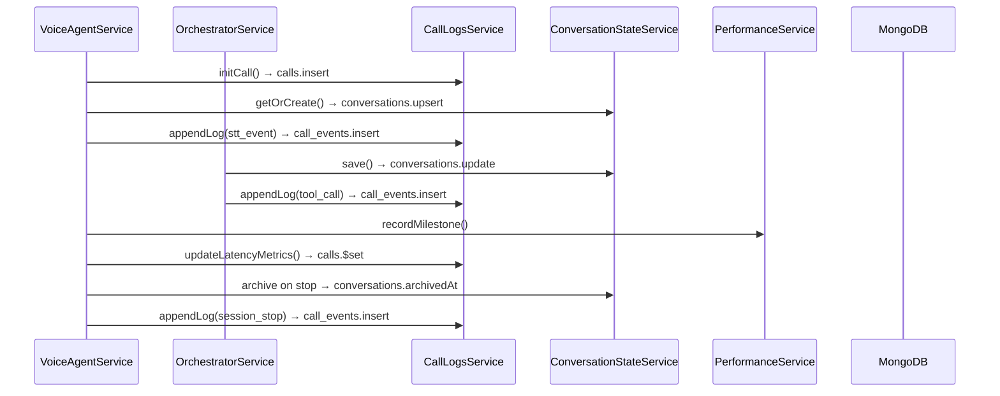

# LiveKit MongoDB Persistence Plan (Phase 1 — Design Only)

This document maps **where persistence is needed** in the current LiveKit voice agent POC, **what data should be stored**, and **proposed MongoDB collections/schemas**. No MongoDB code is implemented in this phase.

**Related docs:**
- [LIVEKIT_VOICE_AGENT_FLOW.md](./LIVEKIT_VOICE_AGENT_FLOW.md)
- [LIVEKIT_AGENT_ORCHESTRATION_IMPLEMENTATION.md](./LIVEKIT_AGENT_ORCHESTRATION_IMPLEMENTATION.md)
- [LIVEKIT_AGENT_ORCHESTRATION_PLAN.md](./LIVEKIT_AGENT_ORCHESTRATION_PLAN.md)

---

## 1. Current state summary

The POC stores durable data in **three in-memory `Map` structures** and one **repository abstraction** already designed for swapping:

| Store | Location | Key | Lifetime | Swap-ready? |
|-------|----------|-----|----------|-------------|
| Call logs | `InMemoryCallLogsRepository` | `callId` | Until process restart | **Yes** — `CallLogsRepository` interface |
| Conversation state | `ConversationStateService` | `callId` | Until `stopSession()` deletes it | No interface yet |
| Performance milestones | `PerformanceService` | `callId` | Until process restart | No interface yet |
| Active voice sessions | `VoiceAgentService.sessions` | `roomName` | Until `stopSession()` | Runtime only — **do not persist** |
| RTC connections | `LivekitRtcService.connections` | `roomName` | Until disconnect | Runtime only — **do not persist** |
| Turn detection timers | `TurnDetectionService` | `callId` | Per-call ephemeral | Runtime only — **do not persist** |
| Tool registry | `ToolRegistryService.tools` | tool name | App lifetime | Code-defined — **not DB** (for now) |

**Important:** Most pipeline services already write through `CallLogsService.appendLog()`. MongoDB adoption should start by replacing the call-logs repository, then extending to conversation state and performance.

---

## 2. Persistence goals

| Goal | Why |
|------|-----|
| **Survive restarts** | Call history, transcripts, tool runs, and latency metrics must remain after NestJS reload |
| **Post-call analysis** | Query past calls by `callId`, `roomName`, `agentId`, time range |
| **Multi-instance readiness** | Future horizontal scaling requires shared state for logs and conversation history |
| **Audit / debugging** | Replay orchestration steps (`tool_call`, `llm_response`, etc.) without reproducing a live call |
| **Webhook correlation** | `LivekitService` looks up calls by `roomName` — must work across instances |

**Non-goals for Phase 1 implementation:**
- Persisting audio PCM, TTS buffers, or STT WebSocket handles
- Replacing in-process RTC/STT session handles
- Storing API keys or LiveKit secrets in MongoDB

---

## 3. Where persistence is needed (by module)

### 3.1 `call-logs` — **Priority 1 (highest)**

**Current files:**
- `src/call-logs/call-logs.service.ts`
- `src/call-logs/repositories/in-memory-call-logs.repository.ts`
- `src/call-logs/interfaces/call-logs-repository.interface.ts`
- `src/common/types/call-log.types.ts`

**Write paths:**

| Method | Called from | What happens |
|--------|-------------|--------------|
| `initCall()` | `VoiceAgentService.startSession()` | Creates `CallRecord` |
| `appendLog()` | Voice agent, orchestration, LiveKit webhooks | Appends `CallLogEntry` to `record.logs[]` |
| `updateLatencyMetrics()` | `VoiceAgentService.processUserUtterance()` | Merges `LatencyMetrics` on record |
| `setParticipantId()` | `onParticipantJoined()`, RTC audio handler | Updates `participantId` |

**Read paths:**

| Method | Called from |
|--------|-------------|
| `getByCallId()` | `CallLogsController`, `VoiceAgentService.getSessionWithLogs()` |
| `getByRoomName()` | `LivekitService.routeWebhookEvent()` |
| `listAll()` | Not used in HTTP APIs yet — useful for admin |

**Log volume concern:** `stt_event` is written on **every** STT interim/final event (`VoiceAgentService.handleSttEvent()`). For MongoDB, prefer **append-only inserts** into a separate `call_events` collection rather than rewriting a large embedded `logs` array.

**Steps logged today (`CallLogStep`):**

```
session_start, session_stop, participant_joined, participant_left,
stt_event, turn_decision, llm_request, llm_response,
tts_start, tts_complete, agent_playback, performance, error, webhook,
orchestration_start, prompt_built, tool_call, tool_result,
response_planned, guardrail_check, orchestration_complete, orchestration_error
```

---

### 3.2 `orchestration` — **Priority 2**

**Current files:**
- `src/orchestration/conversation-state.service.ts`
- `src/orchestration/interfaces/orchestration.types.ts`
- `src/orchestration/orchestrator.service.ts`

**Write paths:**

| Method | When |
|--------|------|
| `getOrCreate()` | Start of each `handleUserTurn()` |
| `save()` | After each LLM round, tool execution, final response |
| `setStep()` | Step transitions (`thinking`, `tool_running`, `speaking`) |
| `delete()` | `VoiceAgentService.stopSession()` — **state is lost today** |

**Data only in conversation state (not fully duplicated in call logs):**

| Field | Persist? | Notes |
|-------|----------|-------|
| `llmMessages[]` | **Yes** | Full LLM thread incl. tool messages — needed for replay/resume |
| `transcriptHistory[]` | **Yes** | Clean user/assistant transcript |
| `toolCallHistory[]` | **Yes** | Structured tool I/O (also partially in `tool_call` / `tool_result` logs) |
| `dynamicVariables` | **Yes** | Retell-style template vars |
| `enabledTools`, `systemPrompt`, `llmProvider` | **Yes** | Session config snapshot |
| `lastUserUtterance`, `lastAgentResponse` | **Yes** | Quick access fields |
| `currentStep`, `retryCount` | **Yes** (active) / archive on end | Hot state during call |
| `agentId`, `participantId`, `roomName` | **Yes** | Indexable metadata |

**Gap today:** `VoiceAgentSession.conversationHistory` (in `voice-agent.service.ts`) and `ConversationState.llmMessages` can **diverge**. MongoDB should treat `conversations` as the **source of truth** for orchestration history; session history becomes a runtime cache or is removed later.

---

### 3.3 `performance` — **Priority 3**

**Current files:**
- `src/performance/performance.service.ts`
- `src/common/types/performance.types.ts`

**Write paths:**

| Method | When |
|--------|------|
| `recordMilestone()` | STT events, LLM/TTS/playback in voice agent |
| `getMetrics()` | End of each turn → copied to `CallRecord.latencyMetrics` |

**Milestones:** `user_speech_start`, `user_speech_end`, `stt_final_transcript`, `llm_start`, `llm_end`, `tts_start`, `tts_end`, `agent_playback_start`

**Design choice:** Embed final `latencyMetrics` on the `calls` document (already done in memory). Optionally store per-turn milestone snapshots in `call_events` or a `performance_turns` sub-collection for analytics.

---

### 3.4 `voice-agent` — **Partial persistence only**

**Current file:** `src/voice-agent/voice-agent.service.ts`

**Persist (snapshot at lifecycle events):**

| Data | When to write |
|------|---------------|
| `callId`, `roomName`, `agentConfig` | `startSession()` — already in `session_start` log |
| `status`, `participantId`, `startedAt`, `updatedAt` | On start, participant join, stop, error |
| `conversationHistory` | Prefer sync from `ConversationState` on each turn / stop |

**Do NOT persist (runtime `ActiveSessionContext`):**

| Field | Reason |
|-------|--------|
| `sttStream` | Open WebSocket / stream handle |
| `isProcessingTurn`, `isAgentSpeaking` | Concurrency flags |
| `rtcConnected` | Derived from `LivekitRtcService` |
| `interimTranscript`, `finalTranscript` | Ephemeral STT buffer (final text ends up in logs/state) |

---

### 3.5 `livekit` — **Indirect persistence**

**Current file:** `src/livekit/livekit.service.ts`

- Webhooks call `callLogsService.getByRoomName(roomName)` — **requires indexed `roomName` on calls**
- Webhook payloads logged via `appendLog(..., 'webhook', { rawEvent })` — can be large; consider trimming or storing event type + ids only

No separate LiveKit collection needed initially; room/participant metadata lives on `calls` + `call_events`.

---

### 3.6 `orchestration/event-logger` — **No new store**

**File:** `src/orchestration/event-logger.service.ts`

Delegates to `CallLogsService`. MongoDB swap at repository layer automatically covers orchestration events.

---

### 3.7 Modules that do **not** need MongoDB

| Module | Reason |
|--------|--------|
| `stt/`, `llm/`, `tts/` | Stateless providers; no call-scoped storage |
| `livekit-rtc/` | In-process RTC handles |
| `turn-detection/` | Timers and pending transcript buffers |
| `tool-registry/` | Tools registered in code at boot |

---

## 4. Proposed MongoDB collections

Recommended database name: `livekit_voice_agent` (configurable via env).

### 4.1 `calls` — one document per voice session

**Purpose:** Canonical call summary, queryable metadata, final latency rollup.

**Source types:** `CallRecord`, `VoiceAgentSession` (partial), `AgentConfig`

```typescript
// Proposed Mongoose-style schema (illustrative)
{
  _id: ObjectId,
  callId: string,           // unique, business key (e.g. "call-abc")
  roomName: string,         // indexed
  participantId?: string,
  agentId?: string,         // from agentConfig.agentId

  status: 'connecting' | 'listening' | 'processing' | 'speaking' | 'stopped' | 'error',

  agentConfig: {
    systemPrompt?: string,
    sttProvider?: string,
    llmProvider?: string,
    ttsProvider?: string,
    voiceId?: string,
    language?: string,
    turnSilenceMs?: number,
    dynamicVariables?: Record<string, string>,
    enabledTools?: string[],
  },

  latencyMetrics: {
    userSpeechStart?: number,
    userSpeechEnd?: number,
    sttFinalTranscript?: number,
    llmStart?: number,
    llmEnd?: number,
    ttsStart?: number,
    ttsEnd?: number,
    agentPlaybackStart?: number,
    totalResponseLatencyMs?: number,
  },

  errors: string[],         // denormalized error messages

  startedAt: Date,          // from session / createdAt
  endedAt?: Date,
  createdAt: Date,
  updatedAt: Date,
}
```

**Indexes:**
```javascript
{ callId: 1 }                    // unique
{ roomName: 1 }                  // webhook lookup
{ agentId: 1, createdAt: -1 }   // agent analytics
{ status: 1, updatedAt: -1 }      // active calls
{ createdAt: -1 }                // recent calls list
```

**Maps to existing code:**
- Replace `CallRecord` root fields in `InMemoryCallLogsRepository`
- `CallLogsService.initCall()` → `insertOne`
- `updateLatencyMetrics()`, `setParticipantId()` → `$set` updates
- **Do not embed full `logs[]` array here** (see `call_events`)

---

### 4.2 `call_events` — append-only event log

**Purpose:** High-volume pipeline + orchestration events; avoids rewriting large call documents.

**Source type:** `CallLogEntry`

```typescript
{
  _id: ObjectId,
  eventId: string,          // maps to CallLogEntry.id (uuid)
  callId: string,           // indexed
  roomId: string,
  participantId?: string,
  step: CallLogStep,        // indexed for filtering
  timestamp: Date,
  data?: object,            // flexible payload — see sanitization below
  error?: string,
  latencyMs?: number,
}
```

**Indexes:**
```javascript
{ callId: 1, timestamp: 1 }
{ callId: 1, step: 1 }
{ timestamp: -1 }           // TTL / archival queries
```

**Write pattern change:** `CallLogsService.appendLog()` should `insertOne` into `call_events` and optionally `$inc` event counters on `calls` — not `push` + full document `update` on every STT interim.

**`data` field examples (from current code):**

| step | Typical `data` shape |
|------|---------------------|
| `session_start` | `{ agentConfig: AgentConfig }` |
| `stt_event` | `{ event: SttEvent }` |
| `turn_decision` | `{ decision: TurnDecision }` |
| `llm_response` | `{ response: { text, toolCalls, finishReason } }` |
| `tool_call` | `{ toolName, args }` |
| `tool_result` | `{ toolName, success, output \| error }` |
| `webhook` | `{ eventType, rawEvent }` — **trim before persist** |
| `performance` | `{ metrics: LatencyMetrics }` |
| `tts_complete` | `{ textLength, audioBytes, durationMs }` — **no audio bytes in DB** |

---

### 4.3 `conversations` — orchestration state per call

**Purpose:** Durable conversation thread, tool history, dynamic variables; enables resume and post-call replay.

**Source type:** `ConversationState`

```typescript
{
  _id: ObjectId,
  callId: string,           // unique, 1:1 with calls
  roomName: string,
  agentId?: string,
  participantId?: string,

  currentStep: 'listening' | 'thinking' | 'tool_running' | 'speaking' | 'ended',
  retryCount: number,

  dynamicVariables: Record<string, string>,
  enabledTools?: string[],
  systemPrompt?: string,
  llmProvider?: string,

  transcriptHistory: [{
    role: 'user' | 'assistant',
    text: string,
    timestamp: Date,
  }],

  llmMessages: [{
    role: 'system' | 'user' | 'assistant' | 'tool',
    content: string,
    toolCalls?: [{ id?: string, name: string, arguments: object }],
    toolCallId?: string,
    name?: string,
  }],

  toolCallHistory: [{
    name: string,
    input: object,
    output?: object,
    error?: string,
    success: boolean,
    timestamp: Date,
  }],

  lastUserUtterance?: string,
  lastAgentResponse?: string,

  startedAt: Date,
  updatedAt: Date,
  archivedAt?: Date,        // set on session_stop instead of hard delete
}
```

**Indexes:**
```javascript
{ callId: 1 }                 // unique
{ roomName: 1 }
{ agentId: 1, updatedAt: -1 }
{ archivedAt: 1 }             // partial index for active: { archivedAt: null }
```

**Lifecycle:**
- `getOrCreate()` → `findOneAndUpdate` upsert on `callId`
- `save()` → update arrays / scalars after each orchestration turn
- `stopSession()` → set `currentStep: 'ended'`, `archivedAt` — **stop calling `delete()`**

**Repository to add later:** `ConversationStateRepository` interface mirroring `CallLogsRepository` pattern.

---

### 4.4 `agents` — optional, future agent definitions

**Purpose:** Store reusable agent configs referenced by `agentId` (not required for first MongoDB slice).

**Not in codebase yet** — today `agentId` and `systemPrompt` come from `POST /voice-agent/start` body only.

```typescript
{
  _id: ObjectId,
  agentId: string,          // unique slug
  name: string,
  systemPrompt: string,
  defaultProviders: {
    stt?: string,
    llm?: string,
    tts?: string,
  },
  enabledTools: string[],
  dynamicVariableSchema?: object,
  createdAt: Date,
  updatedAt: Date,
}
```

Defer until agent management API exists.

---

### 4.5 `post_call_analyses` — optional, future

**Purpose:** Summaries, sentiment, success flags (mentioned in orchestration plan Phase 6).

```typescript
{
  _id: ObjectId,
  callId: string,           // unique
  summary?: string,
  sentiment?: string,
  toolsUsed: string[],
  success: boolean,
  metadata?: object,
  analyzedAt: Date,
}
```

Defer until `PostCallAnalysisService` exists.

---

## 5. Data flow with MongoDB (target architecture)



---

## 6. Repository / module changes (planned, not implemented)

### 6.1 New NestJS module layout

```
src/
├── database/
│   ├── database.module.ts
│   ├── mongoose.config.ts
│   └── constants.ts
├── call-logs/
│   ├── repositories/
│   │   ├── in-memory-call-logs.repository.ts   # keep for tests
│   │   └── mongo-call-logs.repository.ts         # NEW
│   └── ...
└── orchestration/
    ├── interfaces/
    │   └── conversation-state-repository.interface.ts  # NEW
    └── repositories/
        └── mongo-conversation-state.repository.ts      # NEW
```

### 6.2 Swap points (minimal churn)

| Current | Future |
|---------|--------|
| `CALL_LOGS_REPOSITORY` → `InMemoryCallLogsRepository` | Env-driven: `MongoCallLogsRepository` |
| `ConversationStateService` direct `Map` | Inject `ConversationStateRepository` |
| `PerformanceService` `Map` | Persist final metrics via `CallLogsService`; optional milestone events |
| `CallLogsService.appendLog()` | Insert `call_events` + light `calls` update |
| `GET /call-logs/:callId` | Aggregate `calls` + `call_events` (same API shape) |

### 6.3 Config additions (`.env`)

```bash
MONGODB_URI=
MONGODB_DB_NAME=livekit_voice_agent
PERSISTENCE_PROVIDER=memory   # memory | mongodb
CALL_EVENTS_TTL_DAYS=90         # optional TTL on call_events
```

---

## 7. API impact (backward compatible)

Existing endpoints should return the **same JSON shape** after MongoDB:

| Endpoint | Data source after Mongo |
|----------|-------------------------|
| `GET /call-logs/:callId` | `calls` + `call_events` sorted by timestamp |
| `GET /voice-agent/session/:roomName` | Active in-memory session + `calls` + `call_events` + performance |

Optional future endpoints (not in POC today):

- `GET /call-logs?agentId=&from=&to=` — list calls
- `GET /conversations/:callId` — transcript + tool history
- `GET /calls/:callId/transcript` — `transcriptHistory` only

---

## 8. Data retention and size controls

| Concern | Recommendation |
|---------|----------------|
| **STT interim flood** | Consider logging only `final` + `speech_start/end` to Mongo, or sample interims |
| **Webhook `rawEvent`** | Store `eventType`, `roomName`, `participantId`; omit full payload or cap size |
| **Tool output** | `get_user_details` returns PII (email, phone) — apply retention policy |
| **Audio** | Never store `tts_complete.audioBytes` payload; keep length metadata only |
| **TTL** | `call_events` TTL index (e.g. 90 days); keep `calls` + `conversations` longer |
| **Indexes** | Monitor `callId` + `timestamp` compound index growth |

---

## 9. Security and compliance notes

| Risk | Mitigation |
|------|------------|
| PII in transcripts / tool output | Encrypt at rest (MongoDB Atlas), restrict query access, define retention |
| Secrets in logs | Never log API keys; scrub `agentConfig` if secrets added later |
| `session_start` stores full `agentConfig` | Safe today; audit if dynamic vars include tokens |
| Multi-tenant `agentId` | Add `agentId` filter to all queries when multi-tenant |

---

## 10. Implementation phases (recommended order)

### Phase A — Call logs to MongoDB
1. Add `@nestjs/mongoose` + `database` module
2. Implement `MongoCallLogsRepository` (`calls` + `call_events`)
3. Feature flag `PERSISTENCE_PROVIDER=mongodb`
4. Verify `GET /call-logs/:callId` parity

### Phase B — Conversation persistence
1. Add `ConversationStateRepository`
2. Refactor `ConversationStateService` to read/write Mongo
3. Replace `delete()` with `archive` on `stopSession()`
4. Align `VoiceAgentSession.conversationHistory` with `conversations.llmMessages`

### Phase C — Performance and analytics
1. Optional per-turn milestone documents
2. `post_call_analyses` collection + worker
3. List/query APIs for ops dashboard

### Phase D — Agent configs
1. `agents` collection
2. Resolve `agentId` at `startSession()` from DB with request overrides

---

## 11. Mapping table: TypeScript type → MongoDB collection

| TypeScript interface | File | Collection | Notes |
|---------------------|------|------------|-------|
| `CallRecord` (without `logs[]`) | `call-log.types.ts` | `calls` | Split logs out |
| `CallLogEntry` | `call-log.types.ts` | `call_events` | Append-only |
| `LatencyMetrics` | `performance.types.ts` | `calls.latencyMetrics` | Denormalized summary |
| `PerformanceRecord` | `performance.types.ts` | optional `call_events` or embed | Milestones optional |
| `ConversationState` | `orchestration.types.ts` | `conversations` | Source of truth for thread |
| `VoiceAgentSession` | `voice-agent.types.ts` | `calls` (metadata) + runtime Map | Partial |
| `AgentConfig` | `voice-agent.types.ts` | `calls.agentConfig` or `agents` | Snapshot per call |
| `ActiveSessionContext` | `voice-agent.service.ts` | — | **Not persisted** |
| `AgentTool` | `agent-tool.interface.ts` | — | Code registry |

---

## 12. Open questions (decide before coding)

1. **Embedded vs separate events:** Separate `call_events` recommended due to STT volume — confirm with expected call concurrency.
2. **Conversation write frequency:** Full `save()` after every orchestration sub-step vs debounced writes — balance durability vs write load.
3. **Resume after crash:** Should a new agent process resume an active `callId` from Mongo, or only support post-call reads?
4. **Single vs multi-tenant:** Is `agentId` sufficient for isolation, or do we need `orgId`?
5. **Memory fallback:** Keep in-memory repo for local dev / tests when `MONGODB_URI` is unset?

---

## 13. Summary

| Priority | What | Collection | Existing hook |
|----------|------|------------|---------------|
| **P1** | Call metadata + errors + latency | `calls` | `CallLogsRepository` |
| **P1** | Pipeline + orchestration events | `call_events` | `CallLogsService.appendLog()` |
| **P2** | Transcripts, LLM thread, tools | `conversations` | `ConversationStateService` |
| **P3** | Milestone detail | `call_events` or embed | `PerformanceService` |
| **Later** | Agent definitions | `agents` | `agentId` in start DTO |
| **Later** | Post-call AI analysis | `post_call_analyses` | Not built yet |
| **Never** | RTC/STT streams, timers, audio | — | Runtime only |

The smallest high-value first step: **implement `MongoCallLogsRepository`** behind the existing `CALL_LOGS_REPOSITORY` token — no changes to `VoiceAgentService` or `OrchestratorService` required.

---

*Phase 1 complete: design only. No MongoDB dependencies or code changes in this step.*
