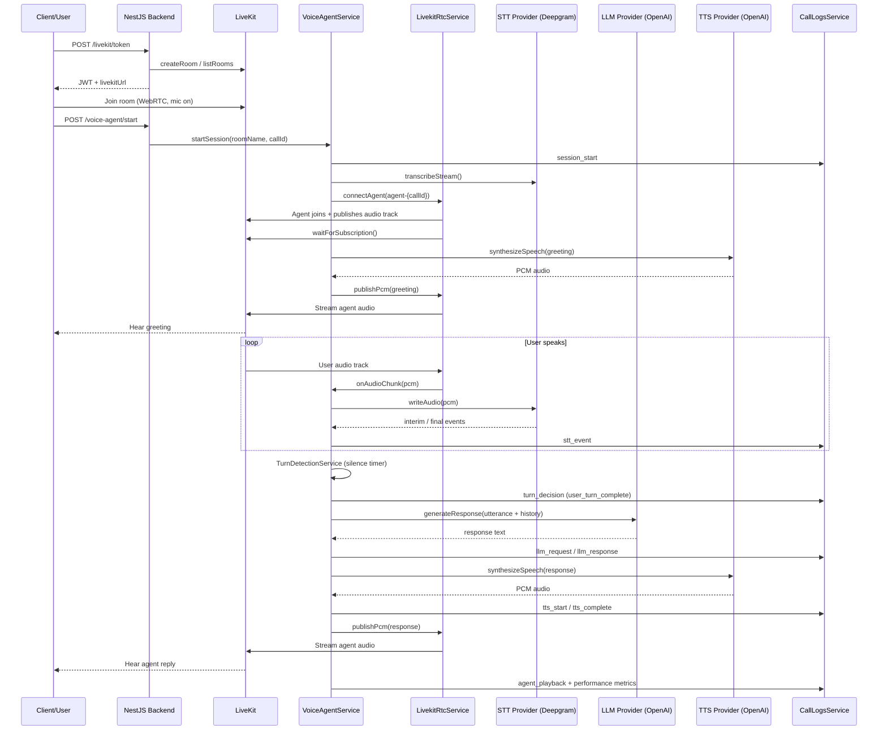

# OdysseusAI Voice Agent — How It Works

This document explains the **actual implementation** in this repository: how a user joins a LiveKit room, how the NestJS backend runs a voice agent, and how audio flows through STT → LLM → TTS.

---

## 1. High-level architecture

The backend is a NestJS app. The voice pipeline is split into small modules. The **orchestrator** (`VoiceAgentService`) does not call Deepgram or OpenAI directly — it goes through provider services.

```
┌──────────────┐     HTTP APIs      ┌─────────────────────────────────────────┐
│ Browser /    │ ─────────────────► │ NestJS Backend                          │
│ LiveKit Meet │                    │                                         │
└──────┬───────┘                    │  livekit/        tokens, rooms, webhooks│
       │                            │  voice-agent/    session orchestration  │
       │ WebRTC                     │  livekit-rtc/    agent join + audio I/O │
       ▼                            │  stt/            speech-to-text         │
┌──────────────┐                    │  llm/            text generation        │
│ LiveKit      │ ◄────────────────► │  tts/            text-to-speech          │
│ Cloud/Server │                    │  call-logs/      per-call event log     │
└──────────────┘                    │  performance/    latency milestones     │
                                    └─────────────────────────────────────────┘
```

### Module roles

| Module | Purpose |
|--------|---------|
| **livekit** | Generate user tokens, create/get rooms, receive LiveKit webhooks |
| **livekit-rtc** | Agent joins room via `@livekit/rtc-node`, subscribes to user mic, publishes TTS audio |
| **voice-agent** | Main orchestration loop: STT events → turn detection → LLM → TTS → playback |
| **stt** | Streaming speech-to-text (Deepgram WebSocket) |
| **llm** | Chat completion (OpenAI live; Claude placeholder) |
| **tts** | Speech synthesis (OpenAI live; ElevenLabs/Cartesia placeholders) |
| **call-logs** | In-memory log of every pipeline step per `callId` |
| **performance** | Timestamps and end-to-end latency calculation |

### How they connect

1. User gets a token from **`POST /livekit/token`** and joins the room in a browser (e.g. LiveKit Meet).
2. Backend starts the agent with **`POST /voice-agent/start`**.
3. `VoiceAgentService` opens a Deepgram stream and tells `LivekitRtcService` to join the same room as `agent-{callId}`.
4. User microphone audio → LiveKit → `LivekitRtcService` → `SttService` → Deepgram.
5. When the user finishes a turn → `TurnDetectionService` → `LlmService` → `TtsService`.
6. TTS PCM audio → `LivekitRtcService.publishPcm()` → LiveKit → user's speakers.
7. Every step is logged via `CallLogsService` and timed via `PerformanceService`.

---

## 2. Step-by-step request flow

### A. `POST /livekit/token`

**Files:** `src/livekit/livekit.controller.ts` → `src/livekit/livekit.service.ts`

1. Client sends `{ roomName, participantName, metadata? }`.
2. `LivekitService.generateToken()` validates LiveKit credentials from env.
3. `getOrCreateRoom(roomName)` uses `RoomServiceClient` to list or create the room on LiveKit.
4. An `AccessToken` JWT is built with grants: `roomJoin`, `canPublish`, `canSubscribe`, `canPublishData`.
5. Response includes `token`, `roomName`, `participantName`, `livekitUrl`.

The user joins the room with this token (client-side; not handled by this backend).

---

### B. User joins LiveKit room

This happens in the browser using the token. The backend is not in the WebRTC path for the **user** — only for the **agent** (via `LivekitRtcService`).

Recommended order for testing:

1. Call `/livekit/token` and join the room.
2. Call `/voice-agent/start` so the agent can subscribe to your mic.

---

### C. `POST /voice-agent/start`

**Files:** `src/voice-agent/voice-agent.controller.ts` → `src/voice-agent/voice-agent.service.ts`

1. Client sends `{ roomName, callId, agentConfig? }`.
2. `startSession()` checks no session already exists for that `roomName`.
3. Merges `agentConfig` with defaults (`systemPrompt`, `turnSilenceMs: 1200`, providers from env).
4. Creates in-memory `VoiceAgentSession` (status: `connecting`).
5. `CallLogsService.initCall()` + log `session_start`.
6. Calls `connectAgentToRoom()` (see below).
7. Sets session status to `listening` and returns the session object.

---

### D. Voice agent connects to the room

**Files:** `src/voice-agent/voice-agent.service.ts` → `src/livekit/livekit-rtc.service.ts`

Inside `connectAgentToRoom()`:

1. **STT stream opens** — `SttService.transcribeStream()` opens a Deepgram WebSocket (`deepgram-stt.provider.ts`). Events are handled by `handleSttEvent()`.
2. **Agent joins via RTC** — `LivekitRtcService.connectAgent()`:
   - Builds JWT for identity `agent-{callId}`.
   - Connects a `Room` with `@livekit/rtc-node`.
   - Creates `AudioSource` (24 kHz mono) and publishes local audio track `agent-voice`.
   - Waits for `trackPublication.waitForSubscription()` so at least one listener is ready.
   - Subscribes to existing remote participants' audio tracks.
3. **Audio callback** — When user PCM arrives, it is passed to `sttStream.writeAudio()` unless `isAgentSpeaking` is true (reduces echo).
4. **Greeting** — `sendGreeting()` runs TTS for a fixed hello message and publishes it to the room.

---

### E. User audio is received

**File:** `src/livekit/livekit-rtc.service.ts` → `handleTrackSubscribed()`

1. On `RoomEvent.TrackSubscribed`, if track is audio and participant is not `agent-*`:
2. Opens an `AudioStream` resampled to **16 kHz mono** (Deepgram input format).
3. Reads PCM frames in a loop and calls the `onAudioChunk` callback.
4. `VoiceAgentService` forwards chunks to the active Deepgram WebSocket.

---

### F. Audio → STT (Deepgram)

**Files:** `src/stt/stt.service.ts` → `src/stt/providers/deepgram-stt.provider.ts`

1. PCM buffers are sent over WebSocket to `wss://api.deepgram.com/v1/listen`.
2. Deepgram returns JSON events; the provider maps them to `SttEvent`:
   - `speech_start` / `speech_end`
   - `interim` (partial transcript)
   - `final` (final transcript)
3. Each event is passed to `VoiceAgentService.handleSttEvent()`.

If `DEEPGRAM_API_KEY` is missing, a **simulated** STT fallback is used instead.

---

### G. Transcript finalized & turn detection

**Files:** `src/voice-agent/voice-agent.service.ts` → `src/voice-agent/turn-detection.service.ts`

1. `handleSttEvent()` logs every STT event to call logs.
2. Updates `session.interimTranscript` / `session.finalTranscript`.
3. Records performance milestones (`user_speech_start`, `stt_final_transcript`, etc.).
4. `TurnDetectionService.detectFromSttEvent()`:
   - On `final`, starts a silence timer (`turnSilenceMs`, default **1200 ms** from config).
   - When the timer fires with a non-empty transcript → `user_turn_complete`.
5. `onUserTurnComplete()` runs only if not already processing and agent is not speaking.

---

### H. Transcript → LLM

**Files:** `src/voice-agent/voice-agent.service.ts` → `src/llm/llm.service.ts` → `src/llm/providers/openai-llm.provider.ts`

1. `processUserUtterance()` sets status to `processing`.
2. Logs `llm_request` with conversation history + user utterance.
3. `LlmService.generateResponse()` calls the configured provider (default: **OpenAI** `gpt-4o-mini`).
4. Response text is appended to `session.conversationHistory` (user + assistant messages).
5. Logs `llm_response` with duration.

---

### I. LLM response → TTS

**Files:** `src/tts/tts.service.ts` → `src/tts/providers/openai-tts.provider.ts`

1. Logs `tts_start`.
2. `TtsService.synthesizeSpeech()` with `format: 'pcm'`, `sampleRate: 24000`.
3. OpenAI TTS returns raw PCM bytes.
4. Logs `tts_complete` with byte count and duration.

---

### J. TTS audio published to LiveKit room

**Files:** `src/voice-agent/voice-agent.service.ts` → `src/livekit/livekit-rtc.service.ts`

1. `speakToRoom()` → `LivekitRtcService.publishPcm()`.
2. PCM is decoded to `Int16Array`, resampled to 24 kHz if needed.
3. Audio is sent in **20 ms frames** via `audioSource.captureFrame()` so barge-in can abort quickly.
4. `waitForPlayout()` waits until audio finishes streaming (or until `stopPlayback` clears the queue).
5. Logs `agent_playback`. On interrupt, logs `agent_interrupted` and returns `'interrupted'`.
6. `isAgentSpeaking` is cleared in `try/finally`; session returns to `listening`.

---

### J2. Barge-in / interruption

While the agent is speaking, STT keeps receiving mic PCM (unless `BARGE_IN_ENABLED=false`, which restores half-duplex gating).

**Detect → confirm → stop → supersede:**

1. Deepgram `speech_start` (or a content-word interim) while `isAgentSpeaking`.
2. Debounce: wait `BARGE_IN_MIN_VOICE_MS` (default 300), and ignore the first `BARGE_IN_START_HOLDOFF_MS` (default 400) of agent speech (echo cooldown). Soft backchannels (`yeah`, `ok`, `hmm`, …) alone do not confirm.
3. On confirm: `stopPlayback()` (`AbortController` + `audioSource.clearQueue()`), bump `responseGenerationId`, set post-interrupt backoff (`BARGE_IN_BACKOFF_MS`), log `agent_interrupted`.
4. In-flight orchestrator / TTS results with a stale generation id are discarded; interrupted assistant text is stored as `[interrupted] …` and is not re-spoken.
5. When the user’s interrupting utterance endpoints (final + silence), a normal new turn runs under the new generation id.

```
User speaks mid-agent-speech
  → STT (always on)
  → speech_start / content interim → debounce confirm
  → stopPlayback + clearQueue + bump generation
  → turn completes → processUserUtterance (new gen)
```

**Manual barge-in checklist**

1. Agent mid-sentence → user asks a full question → agent stops within ~300–500 ms and answers the new question.
2. Soft “mm-hmm” during speech → agent continues.
3. Interrupt during a tool filler (e.g. weather) → no old-turn final answer; new turn handled.
4. Rapid double interrupt → single clean new turn, no overlapping audio.
5. `BARGE_IN_ENABLED=false` → mic dropped while agent speaks (half-duplex).

---

### K. Logs and latency metrics stored

**Files:** `src/call-logs/call-logs.service.ts`, `src/performance/performance.service.ts`

- **Call logs:** Every step (`stt_event`, `llm_request`, `tts_complete`, `error`, etc.) appended to in-memory `CallRecord`.
- **Latency:** Milestones stored per `callId`. `totalResponseLatencyMs` ≈ time from `user_speech_end` to `agent_playback_start`.
- **Read APIs:**
  - `GET /call-logs/:callId`
  - `GET /voice-agent/session/:roomName`

---

### L. LiveKit webhooks (optional)

**File:** `src/livekit/livekit.service.ts` → `POST /livekit/webhook`

When configured in LiveKit Cloud (requires a public URL, e.g. ngrok):

| Event | Action |
|-------|--------|
| `participant_joined` | `voiceAgentService.onParticipantJoined()` — logs participant, updates `participantId` |
| `participant_left` | Logs `participant_left` |
| `room_finished` | `voiceAgentService.stopSession()` — closes STT, disconnects RTC |

Webhook signature is verified with `WebhookReceiver` (API key + secret).

---

## 3. Sequence diagram



---

## 4. Module-level explanation

### livekit

| | |
|---|---|
| **Purpose** | Server-side LiveKit admin: tokens, rooms, webhooks |
| **Key files** | `livekit.service.ts`, `livekit.controller.ts`, `dto/generate-token.dto.ts` |
| **Key methods** | `generateToken()`, `getOrCreateRoom()`, `handleWebhook()`, `routeWebhookEvent()` |
| **Input** | `roomName`, `participantName`, webhook payload |
| **Output** | JWT token; webhook routing to voice agent |

### livekit-rtc

| | |
|---|---|
| **Purpose** | Agent WebRTC connection — real audio in and out |
| **Key files** | `livekit-rtc.service.ts`, `livekit-rtc.module.ts` |
| **Key methods** | `connectAgent()`, `publishPcm()`, `disconnect()`, `handleTrackSubscribed()` |
| **Input** | PCM buffers (16 kHz in from user, 24 kHz out to room) |
| **Output** | Published agent audio track; callbacks with user PCM |

### voice-agent

| | |
|---|---|
| **Purpose** | Orchestrates the full voice pipeline per room |
| **Key files** | `voice-agent.service.ts`, `voice-agent.controller.ts`, `turn-detection.service.ts`, `dto/start-voice-agent.dto.ts` |
| **Key methods** | `startSession()`, `connectAgentToRoom()`, `handleSttEvent()`, `onUserTurnComplete()`, `processUserUtterance()`, `speakToRoom()`, `stopSession()` |
| **Input** | `roomName`, `callId`, `agentConfig` |
| **Output** | Session state; drives STT/LLM/TTS/RTC |

### stt

| | |
|---|---|
| **Purpose** | Swappable streaming STT |
| **Key files** | `stt.service.ts`, `providers/deepgram-stt.provider.ts`, `interfaces/stt-provider.interface.ts` |
| **Key methods** | `transcribeStream()` → `{ writeAudio(), onEvent(), end() }` |
| **Input** | 16 kHz PCM chunks |
| **Output** | `SttEvent` stream (interim/final/speech_start/end) |

### llm

| | |
|---|---|
| **Purpose** | Swappable text generation |
| **Key files** | `llm.service.ts`, `providers/openai-llm.provider.ts`, `providers/claude-llm.provider.ts` |
| **Key methods** | `generateResponse(request, providerName?)` |
| **Input** | `conversationHistory`, `userUtterance`, `systemPrompt` |
| **Output** | `{ text, model?, usage? }` |

### tts

| | |
|---|---|
| **Purpose** | Swappable speech synthesis |
| **Key files** | `tts.service.ts`, `providers/openai-tts.provider.ts`, `providers/elevenlabs-tts.provider.ts`, `providers/cartesia-tts.provider.ts` |
| **Key methods** | `synthesizeSpeech(request, providerName?)` |
| **Input** | Plain text, optional `voiceId`, `format`, `sampleRate` |
| **Output** | `{ audio: Buffer, format, durationMs, sampleRate }` |

### call-logs

| | |
|---|---|
| **Purpose** | Per-call debugging and audit trail |
| **Key files** | `call-logs.service.ts`, `call-logs.controller.ts`, `repositories/in-memory-call-logs.repository.ts` |
| **Key methods** | `initCall()`, `appendLog()`, `getByCallId()`, `updateLatencyMetrics()` |
| **Input** | `callId`, step name, payload |
| **Output** | `CallRecord` with logs array and `latencyMetrics` |

### performance

| | |
|---|---|
| **Purpose** | Measure pipeline latency |
| **Key files** | `performance.service.ts` |
| **Key methods** | `recordMilestone()`, `getMetrics()`, `getRecord()` |
| **Input** | `callId`, milestone name |
| **Output** | `LatencyMetrics` including `totalResponseLatencyMs` |

### common/types

Shared TypeScript interfaces for STT events, LLM messages, TTS results, turn decisions, session state, and log entries under `src/common/types/`.

### config

| | |
|---|---|
| **Purpose** | Load env into NestJS `ConfigService` |
| **Key file** | `src/config/configuration.ts` |

---

## 5. Important environment variables

Set these in `.env` (see `.env.example` for placeholders).

| Variable | Used for |
|----------|----------|
| `PORT` | NestJS HTTP port (default `3000`) |
| `LIVEKIT_URL` | WebSocket URL for LiveKit (`wss://...`) — RTC connect + returned to clients |
| `LIVEKIT_API_KEY` | LiveKit API key — tokens, room API, webhook verification |
| `LIVEKIT_API_SECRET` | LiveKit API secret — JWT signing and webhook verification |
| `LIVEKIT_WEBHOOK_SECRET` | Defined in config; **webhook verification currently uses API key + secret** via `WebhookReceiver` |
| `LIVEKIT_SIP_ENABLED` | SIP placeholder flag (`true`/`false`) |
| `LIVEKIT_SIP_TRUNK_ID` | SIP trunk placeholder (not wired) |
| `LIVEKIT_SIP_DISPATCH_RULE_ID` | SIP dispatch rule placeholder (not wired) |
| `DEEPGRAM_API_KEY` | Deepgram streaming STT |
| `DEFAULT_STT_PROVIDER` | Default STT name (`deepgram`) |
| `OPENAI_API_KEY` | OpenAI LLM + OpenAI TTS |
| `ANTHROPIC_API_KEY` | Claude LLM (placeholder provider) |
| `DEFAULT_LLM_PROVIDER` | Default LLM name (`openai` or `claude`) |
| `ELEVENLABS_API_KEY` | ElevenLabs TTS (placeholder provider) |
| `CARTESIA_API_KEY` | Cartesia TTS (placeholder provider) |
| `DEFAULT_TTS_PROVIDER` | Default TTS name; if `elevenlabs` with no key, code falls back to `openai` |
| `BARGE_IN_ENABLED` | `true` (default) — listen while speaking; `false` restores half-duplex |
| `BARGE_IN_MIN_VOICE_MS` | Continuous speech required to confirm barge-in (default `300`) |
| `BARGE_IN_START_HOLDOFF_MS` | Ignore barge-in for this long after agent speech starts (default `400`) |
| `BARGE_IN_BACKOFF_MS` | Delay before agent may speak again after interrupt (default `700`) |

Provider selection can also be overridden per session in `agentConfig` on `POST /voice-agent/start`.

---

## 6. Current placeholders / incomplete parts

| Area | Status | Location |
|------|--------|----------|
| **Deepgram STT** | **Live** (WebSocket) | `deepgram-stt.provider.ts` |
| **OpenAI LLM** | **Live** | `openai-llm.provider.ts` |
| **OpenAI TTS** | **Live** | `openai-tts.provider.ts` |
| **Claude LLM** | Placeholder (simulated text) | `claude-llm.provider.ts` |
| **ElevenLabs TTS** | Placeholder (silent PCM if no key) | `elevenlabs-tts.provider.ts` |
| **Cartesia TTS** | Placeholder | `cartesia-tts.provider.ts` |
| **STT without API key** | Simulated fallback | `deepgram-stt.provider.ts` → `createSimulatedStream()` |
| **Turn detection** | Silence timer after `final` + Deepgram speech events | `turn-detection.service.ts` |
| **Barge-in** | **Live** (Deepgram debounce + RTC `stopPlayback`) | `voice-agent.service.ts`, `barge-in.util.ts`, `livekit-rtc.service.ts` |
| **SIP / phone calls** | Env placeholders only | `configuration.ts` |
| **Call log storage** | In-memory only (Mongo optional) | call-logs repositories |
| **Streaming LLM/TTS cancel mid-token** | Not implemented | future |
| **Abort in-flight HTTP tools** | Not implemented — late results discarded via generation id | orchestration |
| **LiveKit Agents adaptive interruption** | Out of scope (custom Nest pipeline) | — |

---

## 7. Debugging guide

### Token generation issues

- **Symptom:** `400` — LiveKit credentials not configured.
- **Check:** `LIVEKIT_URL`, `LIVEKIT_API_KEY`, `LIVEKIT_API_SECRET` in `.env`.
- **Logs:** `LivekitService` — `Generated token for participant...` or `Created LiveKit room...`.
- **File:** `src/livekit/livekit.service.ts` → `generateToken()`, `getOrCreateRoom()`.

### Webhook issues

- **Symptom:** `400 Invalid webhook signature`.
- **Check:** LiveKit Cloud webhook URL points to your server (`/livekit/webhook`); API key/secret match project.
- **Note:** Localhost needs ngrok or similar for LiveKit Cloud to reach you.
- **File:** `src/livekit/livekit.service.ts` → `handleWebhook()`.

### Agent session start issues

- **Symptom:** `409` — session already active for room.
- **Symptom:** Agent never appears in Meet — `/voice-agent/start` not called, or wrong `roomName`.
- **Check:** Nest logs for `Agent "agent-{callId}" connected to room`.
- **File:** `src/voice-agent/voice-agent.service.ts` → `startSession()`.

### STT failures

- **Symptom:** No transcripts in logs.
- **Check:** `DEEPGRAM_API_KEY`; user mic enabled in browser; agent subscribed (`Subscribed to audio from "user-..."`).
- **Check:** `isAgentSpeaking` may block STT during agent playback (by design).
- **Logs:** `DeepgramSttProvider` — `STT interim/final`; `call-logs` step `stt_event`.
- **File:** `src/stt/providers/deepgram-stt.provider.ts`.

### LLM failures

- **Symptom:** `error` log step; session status `error`.
- **Check:** `OPENAI_API_KEY`; OpenAI API errors in Nest logs.
- **Logs:** `llm_request` / `llm_response` or `error` in `GET /call-logs/:callId`.
- **File:** `src/llm/providers/openai-llm.provider.ts`.

### TTS / playback failures

- **Symptom:** Pipeline completes but no audio heard.
- **Check logs for:**
  - `Listener ready for agent audio`
  - `Streaming N samples (Xs, peak=YYYY)` — peak should be **> 1000** for real speech
  - `Finished audio playback`
- **Check:** Use `ttsProvider: "openai"` if ElevenLabs key is empty.
- **Check:** User still in room during playback; Meet not muting agent tile.
- **File:** `src/livekit/livekit-rtc.service.ts` → `publishPcm()`.

### Latency / logging issues

- **View full trace:** `GET /call-logs/:callId` or `GET /voice-agent/session/:roomName`.
- **Key metric:** `latencyMetrics.totalResponseLatencyMs` in call record.
- **Tune:** `agentConfig.turnSilenceMs` (higher = waits longer before sending to LLM).
- **File:** `src/performance/performance.service.ts`.

---

## 8. Example end-to-end flow

### Setup

```bash
# 1. User token
curl -X POST http://localhost:3000/livekit/token \
  -H "Content-Type: application/json" \
  -d '{"roomName":"demo-room","participantName":"user-alice"}'

# 2. Join room in LiveKit Meet with returned token + livekitUrl

# 3. Start agent
curl -X POST http://localhost:3000/voice-agent/start \
  -H "Content-Type: application/json" \
  -d '{
    "roomName": "demo-room",
    "callId": "call-demo-001",
    "agentConfig": {
      "systemPrompt": "You are a helpful assistant.",
      "sttProvider": "deepgram",
      "llmProvider": "openai",
      "ttsProvider": "openai",
      "turnSilenceMs": 1200
    }
  }'
```

### What happens

| Step | What occurs |
|------|-------------|
| 1 | Agent joins as `agent-call-demo-001`, publishes audio track |
| 2 | User hears greeting: *"Hello! I am your voice assistant..."* |
| 3 | User says: *"What is today's date?"* |
| 4 | Deepgram emits interim then final transcript |
| 5 | After 1200 ms silence, turn completes |
| 6 | OpenAI LLM returns e.g. *"Today is Tuesday, July 7, 2026."* |
| 7 | OpenAI TTS generates PCM; agent speaks in room |
| 8 | Logs and metrics stored under `call-demo-001` |

### Sample log steps (`GET /call-logs/call-demo-001`)

```json
[
  { "step": "session_start", "data": { "agentConfig": { "...": "..." } } },
  { "step": "agent_playback", "data": { "greeting": true } },
  { "step": "stt_event", "data": { "event": { "type": "interim", "transcript": "what is today" } } },
  { "step": "stt_event", "data": { "event": { "type": "final", "transcript": "what is today's date" } } },
  { "step": "turn_decision", "data": { "decision": { "type": "user_turn_complete", "transcript": "what is today's date" } } },
  { "step": "llm_request", "data": { "request": { "userUtterance": "what is today's date" } } },
  { "step": "llm_response", "data": { "response": { "text": "Today is Tuesday, July 7, 2026." } } },
  { "step": "tts_start", "data": { "textLength": 32 } },
  { "step": "tts_complete", "data": { "audioBytes": 89400, "format": "pcm" } },
  { "step": "agent_playback", "data": { "audioBytes": 89400 } },
  { "step": "performance", "data": { "metrics": { "totalResponseLatencyMs": 4200 } } }
]
```

### Sample NestJS log lines (abbreviated)

```
[LivekitRtcService] Agent "agent-call-demo-001" connected to room "demo-room"
[LivekitRtcService] Listener ready for agent audio in room "demo-room"
[LivekitRtcService] Streaming 84000 samples (3.5s, peak=17191) to room "demo-room"
[DeepgramSttProvider] [call-demo-001] STT final: what is today's date
[TurnDetectionService] [call-demo-001] Turn complete: "what is today's date"
[LlmService] Generating LLM response with provider: openai
[TtsService] Synthesizing speech (32 chars) with provider: openai
[LivekitRtcService] Finished audio playback in room "demo-room"
```

---

## Quick reference — entry points

| Action | API | Main file |
|--------|-----|-----------|
| Get user token | `POST /livekit/token` | `livekit.controller.ts` |
| Start agent | `POST /voice-agent/start` | `voice-agent.controller.ts` |
| View session + logs | `GET /voice-agent/session/:roomName` | `voice-agent.controller.ts` |
| View call logs | `GET /call-logs/:callId` | `call-logs.controller.ts` |
| LiveKit events | `POST /livekit/webhook` | `livekit.controller.ts` |

**Orchestration heart:** `src/voice-agent/voice-agent.service.ts`
